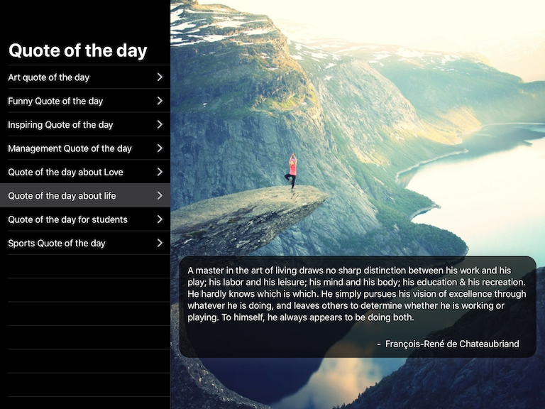

# QOTD

An example app using SwiftUI, WeeDux and SwifTEA.

## Overview

SwiftUI gives us the opportunity to exploit unidirectional data flow within iOS and related platforms. The QOTD application shows how to use [WeeDux](https://github.com/weegigs/weedux) to drive SwiftUI and explores the ergonomics of the solution.

QOTD uses the free API from [theysaidso.com](https://theysaidso.com/api/). The free version places significant access limitations (10 calls an hour) without a key. While this would not be ideal for a production application it great in our purposes as it allows us to explore error handing and retries.

## Examples

- [X] Creating a `Program` and `Model` with persistence support
- [X] Using `Message`s to drive `View` updates
- [X] Service access via `Command`s
- [X] Remote images with stateless components
- [X] Displaying errors when a resource loading fails
- [X] Cancelling work when a `View` disappears
- [ ] Control interactions
- [ ] Unit Test Examples

>At the time of writing a bug is `SwiftUI` is preventing the `onDisappear` method
being called. This prevents the various cancel messages from being fired.

If there are any other examples you'd like to see, just let me know.

## Slides

The slides from my talk at CocoaHeads Melbourne can be found at [SwifTEA UI - Unidirectional dataflow with SwiftUI and WeeDux](https://www.slideshare.net/KevinONeill1/swiftea-ui-unidirectional-data-flow-with-swiftui-and-weedux)
